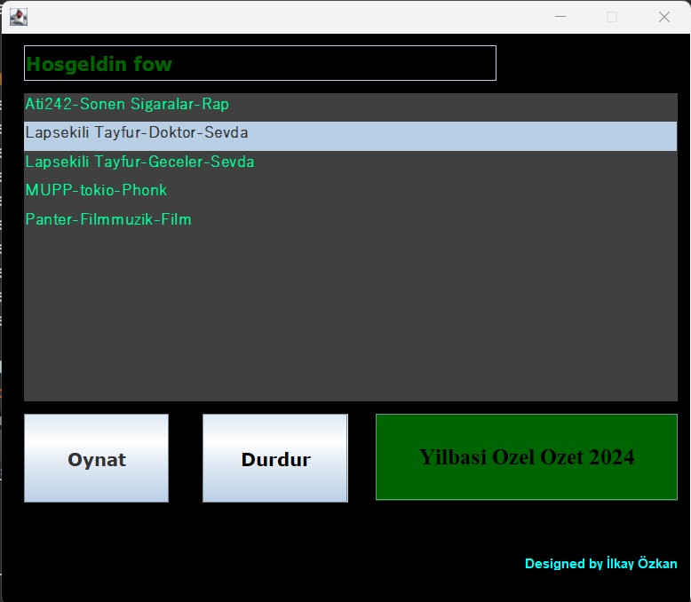
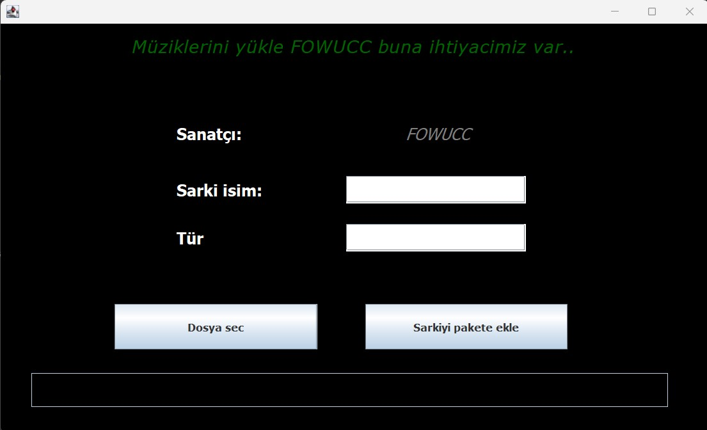
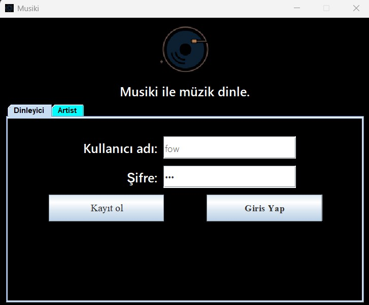
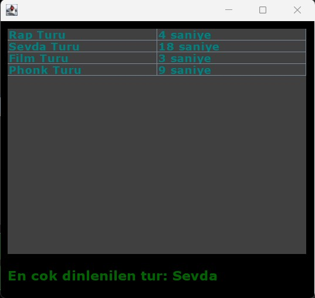

# MusikiSwing

                ___________      ______________      _____             _____         
               /          /     /    _____    /     /    /            /    /         
              /   _______/     /   /     /   /     /    /            /    /          
             /   /____        /   /     /   /     /    /    ___     /    /           
            /   _____/       /   /     /   /     /    /    /   \   /    /           
           /   /            /   /     /   /     /    /   /     \  /    /            
          /   /            /   /____ /   /     /     \ /   /\  \ /    /           
         /___/            /_____________/     /__________/   \_______/         


# MusikiSwing Müzik Çalar

**MusikiSwing**, Nesne Tabanlı Programlama (NTP) ilkeleri kullanılarak Java Swing ile geliştirilmiş bir masaüstü müzik çalma uygulamasıdır.

Bu proje, kullanıcılara basit ve kullanışlı bir arayüz üzerinden `.wav` formatındaki müzik dosyalarını yönetme ve oynatma imkanı sunar.

## 🎵 Özellikler

- **Müzik Çalma:** Seçilen `.wav` dosyalarını oynatma.
- **Kontrol Düğmeleri:** Müziği Durdurma, Başlatma ve Sıfırlama (başa sarma).
- **Dosya Seçimi:** Bilgisayardan müzik dosyası seçmek için dosya gezgini entegrasyonu.
- **Döngü (Loop):** Müziği sürekli olarak tekrarlama özelliği.
- **Basit ve Kullanıcı Dostu Arayüz:** Java Swing ile tasarlanmış temiz ve anlaşılır arayüz.

## 📸 Ekran Görüntüleri


**Ana Arayüz**
*Uygulamanın ana penceresi ve kontrol düğmeleri.*
<br>


**Dosya Seçim Ekranı**
*Yeni bir müzik dosyası seçerken kullanılan dosya gezgini.*
<br>


**Giriş Ekranı**
*Giriş Ekranı*
<br>


**Özet Ekranı**
*Özet Ekranı*
<br>



## 💻 Kullanılan Teknolojiler

- **Java:** Uygulamanın ana programlama dili.
- **Java Swing:** Masaüstü kullanıcı arayüzü (GUI) için kullanılmıştır.

## 🚀 Kurulum ve Çalıştırma

Projeyi yerel makinenizde çalıştırmak için aşağıdaki adımları izleyebilirsiniz.

**1. Projeyi Klonlayın:**
```bash
git clone https://github.com/OzkanJava/MusikiSwing.git
